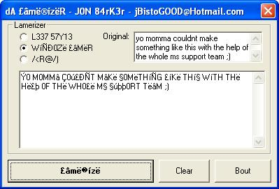

## The lamerizer \( or lameriser \) \( or Thë £âmë®ízë® \)

### Description

Youve all seen that stup1d squiggly text people use in chatrooms etc... You CaN NoW eaSiLY WRiTe LiKe a ReaL LaMeR (ÎÑ ÇÃ$Ê ÝÖú ÑÊÊÐ †Ö fâkÊ TÖ ßÊ §úçH...). No delamerizer as of yet :( pulls the text from a textbox and uses the [ replace ] command... no commenting... but it seems reasonably easy to understand.. :)... jB
 
### More Info
 
hey b1tch... u aint 1337 yet...

makes text look stupid and hard to read... ;)

             |
---                |---
**Submitted On**   |2001-10-10 20:11:38
**By**             |[Jon Barker](https://github.com/Planet-Source-Code/PSCIndex/blob/master/ByAuthor/jon-barker.md)
**Level**          |Beginner
**User Rating**    |4.4 (22 globes from 5 users)
**Compatibility**  |VB 3\.0, VB 4\.0 \(16\-bit\), VB 4\.0 \(32\-bit\), VB 5\.0, VB 6\.0, VBA MS Excel
**Category**       |[String Manipulation](https://github.com/Planet-Source-Code/PSCIndex/blob/master/ByCategory/string-manipulation__1-5.md)
**World**          |[Visual Basic](https://github.com/Planet-Source-Code/PSCIndex/blob/master/ByWorld/visual-basic.md)
**Archive File**   |[The lameri2839110102001\.zip](https://github.com/Planet-Source-Code/jon-barker-the-lamerizer-or-lameriser-or-th-m-z__1-27972/archive/master.zip)

